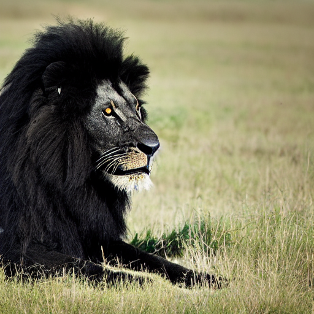
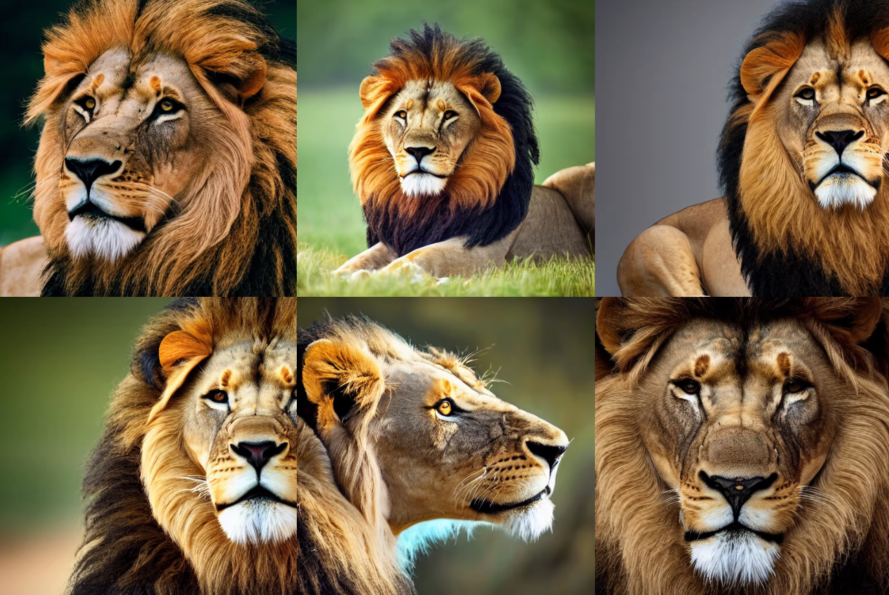
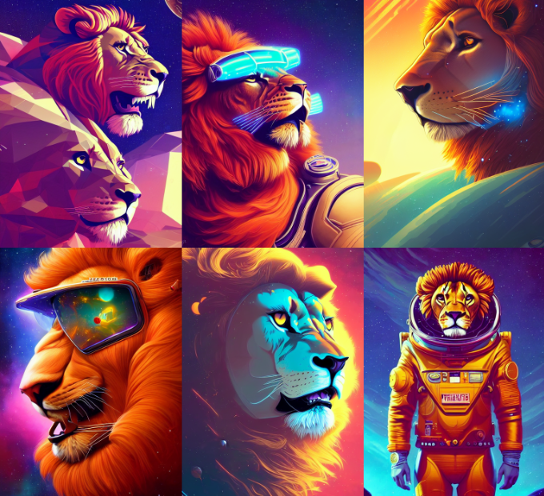

## 1. Quick start 

Recently, the [Stable Diffusion Public Release](https://stability.ai/blog/stable-diffusion-public-release) made available to everyone one of the most powerful deep learning model for image generation. 

This repository is a collection of simple scripts that can be used to generate images with Stable Diffusion and gives an introduction to the theory behind diffusion models.

A short introduction on the ideas behind the diffusion models is [here](https://docs.google.com/presentation/d/1jUO9jZLtUGoK7kgg0kurBgDwDsNOLybrYKU-O2y98xM/edit?usp=sharing).

To start using Stable Diffusion, you first need to create an account on [Huggin's Face](https://huggingface.co/), generate a [token](https://huggingface.co/docs/hub/security-tokens) and accept the [conditions](https://huggingface.co/CompVis/stable-diffusion-v-1-4-original). Afterwards, if you have access to a GPU server, you can follow the basic tutorial in the [model card](https://huggingface.co/CompVis/stable-diffusion-v1-4).
If you don't have a GPU server to run the model, you can try out Stable Diffusion using one of the Colab notebooks below.

- Text to image 
- Image to image 

## 2. Prompt engineering guide
Let's say you want to draw an image of ``lion``. The raw promt, ``lion`` will give you images that are usually a bit chaotic or worse quality.

To obtain better results, the prompt should be egineered. A basic recipe is the following:

``raw prompt`` + ``style`` + ``artist`` + ``details``

- Examples of ``style`` are: *Portrait*, *Realistic*, *Oil painting*, *Pencil drawing*, *Concept art*
- Examples of ``artist`` are: Jan van Eyck (when ``style`` = *Portrait*), *Vincent Van Gogh* (when ``style`` = *Oil painting*), *Leonardo Da Vinci* (when ``style`` = *Pencil drawing*), and so on. Note that you can also mix artists, to get original results.
- Examples of ``details`` are *Unreal Engine* if you want to add realistic lightining, *8 k* if you want to add more details, *artstation* if you want to make your image more artistic, and so on.

Example of elaborated prompts: 

*"Professional photograph of a lion with a black mane, high quality, highly detailed, award-winning, hd, 8k, awe-inspirin"*

*"retrofuturistic portrait of a lion in astro suit, space graphics art in background, close up, wlop, dan mumford, artgerm, liam brazier, peter mohrbacher, raw, featured in artstation, octane render, cinematic, elegant, intricate, 8 k"*

To see more examples of prompts and get inspirations, check [here](https://lexica.art/).

## 3. Diffusion model theory and step-by-step implementation

Pytorch implementation of the diffussion model presented in [].

## 4. Resources

**Repositories**
- A browser interface based on Gradio library for Stable Diffusion - [Github](https://github.com/AUTOMATIC1111/stable-diffusion-webui).

**Colab notebooks**
- Introduction to diffusers 🧨, the Hugging Face 🤗 library for diffusion models 
- Introduction to Stable Diffusion with diffusers 🧨 
- Image2Image pipeline for Stable Diffusion 
- Denoising Diffusion Implicit Models in Tensorflow/Keras 
- Generate video animations  (you need to download the weights from [here](https://huggingface.co/CompVis/stable-diffusion-v-1-4-original) and upload them to your Google Drive)

**Blogs**
- [What are Diffusion Models?](https://lilianweng.github.io/posts/2021-07-11-diffusion-models/#nice) introduction to Diffusion models and mathematical derivations.
- [The Annotated Diffusion Model](https://huggingface.co/blog/annotated-diffusion) step-by-step tutorial for building a Diffusion model from scratch in Pytorch
- [Generative Modeling by Estimating Gradients of the Data Distribution](https://yang-song.net/blog/2021/score/) Introduction to score-based generative models.

**Papers**
- [[1](https://openaccess.thecvf.com/content/CVPR2022/papers/Rombach_High-Resolution_Image_Synthesis_With_Latent_Diffusion_Models_CVPR_2022_paper.pdf)] Rombach, Robin, et al. "High-resolution image synthesis with latent diffusion models." Proceedings of the IEEE/CVF Conference on Computer Vision and Pattern Recognition. 2022.